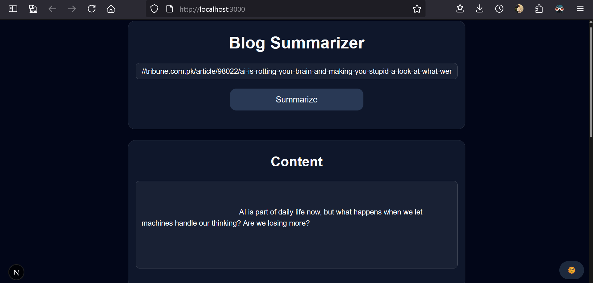

# 📚 Blog Summarizer 

A full-stack AI-powered web app that scrapes blogs in real-time, summarizes them using Google Gemini AI, and translates summaries to Urdu. Users can save the original content and summary to MongoDB and Supabase respectively.

## 📸 Screenshots

## 🔗 Live Demo
🔗 [View on Vercel](https://nexium-saad-assignment-2.vercel.app)

## 🚀 Features

- 🔍 **Blog URL input**
- ✂️ **Real-time scraping** using `JSDOM`
- 🧠 **Summarization** via Gemini AI
- 🌐 **Urdu translation** of summaries
- 💾 **Save full content to MongoDB**
- ☁️ **Save summary to Supabase**
- 🌙 **Light/Dark mode toggle**

## 🛠️ Tech Stack

- **Framework**: Next.js 15 (App Router)
- **Styling**: Tailwind CSS + ShadCN UI
- **Dark Mode**: next-themes
- **State Management**: React Hooks
- **AI Summarization**: Google Generative AI (Gemini)
- **Blog Scraping**: jsdom + @mozilla/readability
- **Databases**:
  - 📦 MongoDB (blog content)
  - 🔐 Supabase (summary)
- **Deployment**: Vercel
