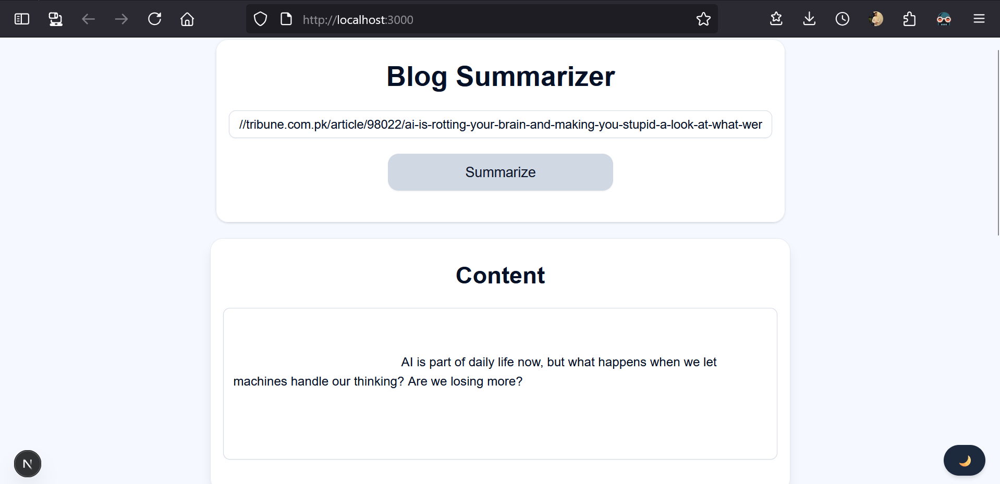

# Blog Summarizer
A full-stack AI-powered web app that scrapes blogs in real-time, summarizes them using Google Gemini AI, and translates the summaries into Urdu. The original content can be saved to MongoDB, while the Urdu summaries can be stored in Supabase.

## Table of Contents

- [Features](#features)  
- [Screenshots](#screenshots)  
- [Live Preview](#live-preview)  
- [Technologies Used](#technologies-used)  
- [Usage](#usage)  
- [Contributing](#contributing)  

## Features
- Real-time blog scraping using JSDOM  
- Summarization via Gemini AI  
- Urdu translation of summaries  
- Save full content to MongoDB  
- Save summaries to Supabase  
- Light/Dark mode toggle  

## Screenshots

  
  
  

## Live Preview

Click [here](https://nexium-saad-assignment-2.vercel.app) to view live demo.

## Technologies Used

- Next.js 15
- React  
- TypeScript  
- Tailwind CSS  
- ShadCN UI  
- next-themes
- Gemini AI 
- MongoDB
- Supabase 

## Usage

1. Clone the repository:  
   `git clone https://github.com/MianSaadTahir/Nexium_Saad_Internship.git`
2. Navigate to the project folder:  
   `cd .\assignment-2\`
3. Install dependencies:  
   `npm install`
4. Start the development server:  
   `npm run dev`
5. Open the local address shown in the terminal `(e.g., http://localhost:3000)` in your browser

## Contributing

Contributions, issues, and feature requests are welcome!  
Feel free to check out the [issues page](https://github.com/MianSaadTahir/Nexium_Saad_Internship/issues) for more information.
