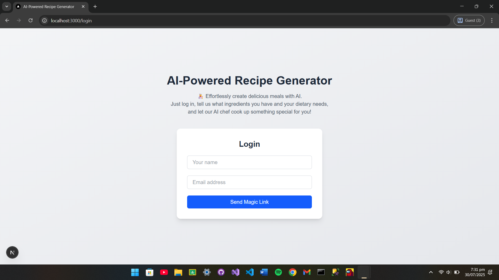
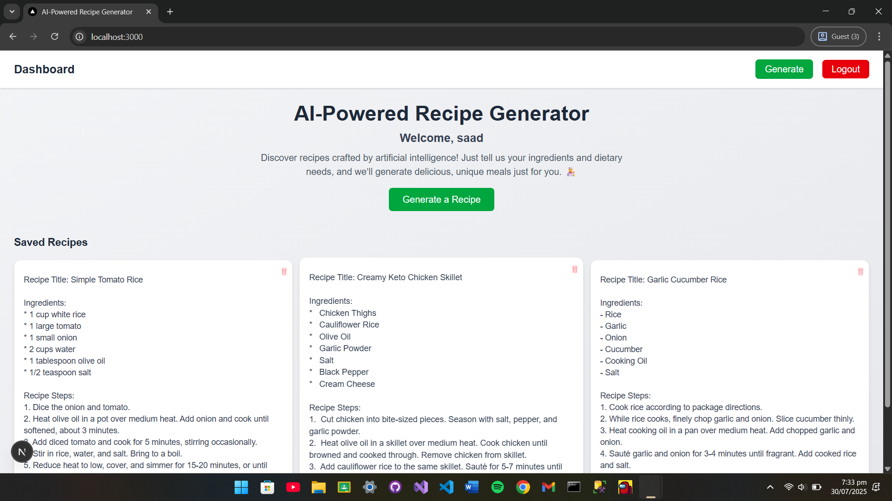
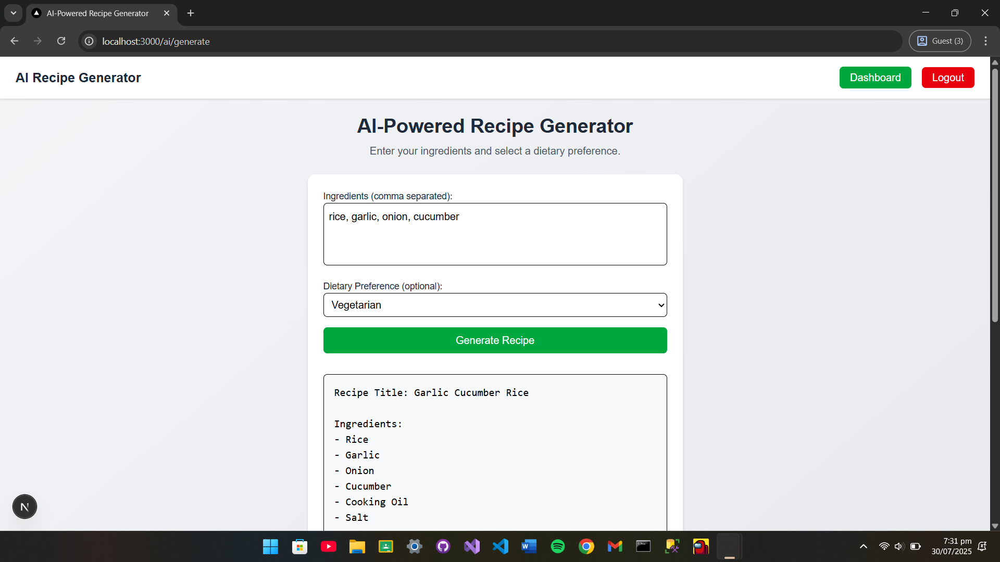
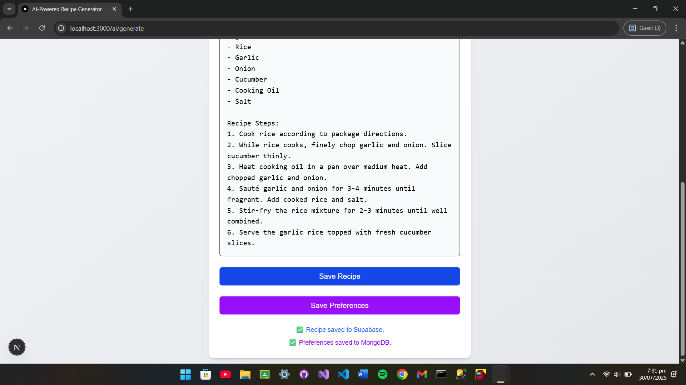
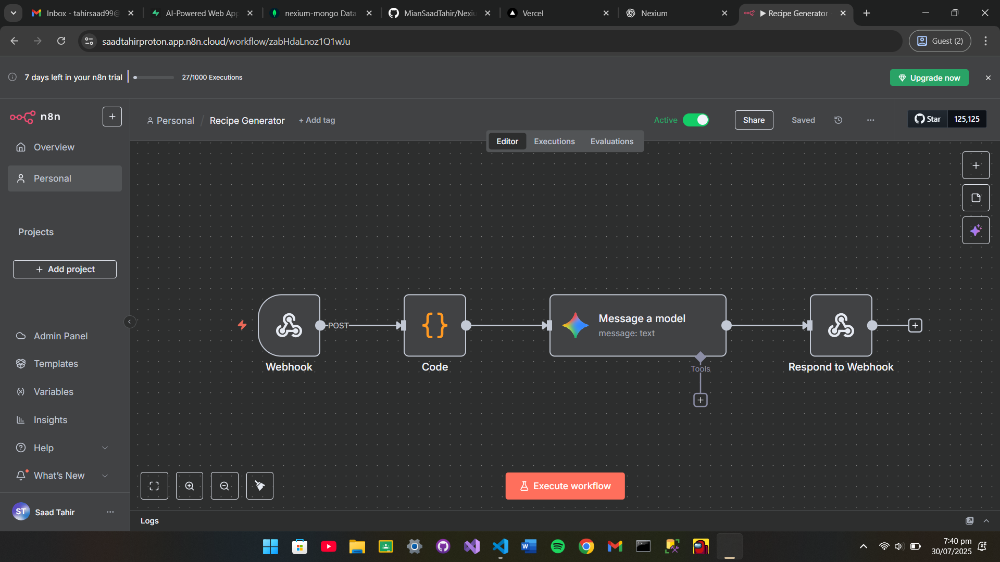

# AI-Powered Recipe Generator

A full-stack AI web app that creates unique, personalized recipes based on your ingredients and dietary needs. It uses n8n workflow with Google Gemini AI to generate meals, and stores preferences in MongoDB and recipes in Supabase.

## Table of Contents

- [Features](#features)  
- [Screenshots](#screenshots)  
- [Live Preview](#live-preview)  
- [Technologies Used](#technologies-used)  
- [Usage](#usage)  
- [Contributing](#contributing)  

## Features
- Secure authentication with Supabase magic link login  
- AI-powered recipe generation using n8n with Google Gemini AI  
- Webhook-based logic with cleaned prompts  
- Save dietary preferences to MongoDB  
- Save generated recipes to Supabase  
- Responsive UI with Tailwind CSS  

## Screenshots

  
  
  
  
  

## Live Preview

Click [here](https://nexium-saad-grand-project.vercel.app) to view live demo.

## Technologies Used

- Next.js 15
- React  
- TypeScript  
- Tailwind CSS  
- n8n
- Gemini AI  
- MongoDB 
- Supabase

## Usage

1. Clone the repository:  
   `git clone https://github.com/MianSaadTahir/Nexium_Saad_Internship.git`
2. Navigate to the project folder:  
   `cd .\grand-project\`
3. Configure environment variables in `.env` with your Supabase and MongoDB credentials  
4. Install dependencies:  
   `npm install`
5. Start the development server:  
   `npm run dev`
6. Open the local address shown in the terminal `(e.g., http://localhost:3000)` in your browser  

## Contributing

Contributions, issues, and feature requests are welcome.  
Feel free to check out the [issues page](https://github.com/MianSaadTahir/Nexium_Saad_Internship/issues) for more information.
